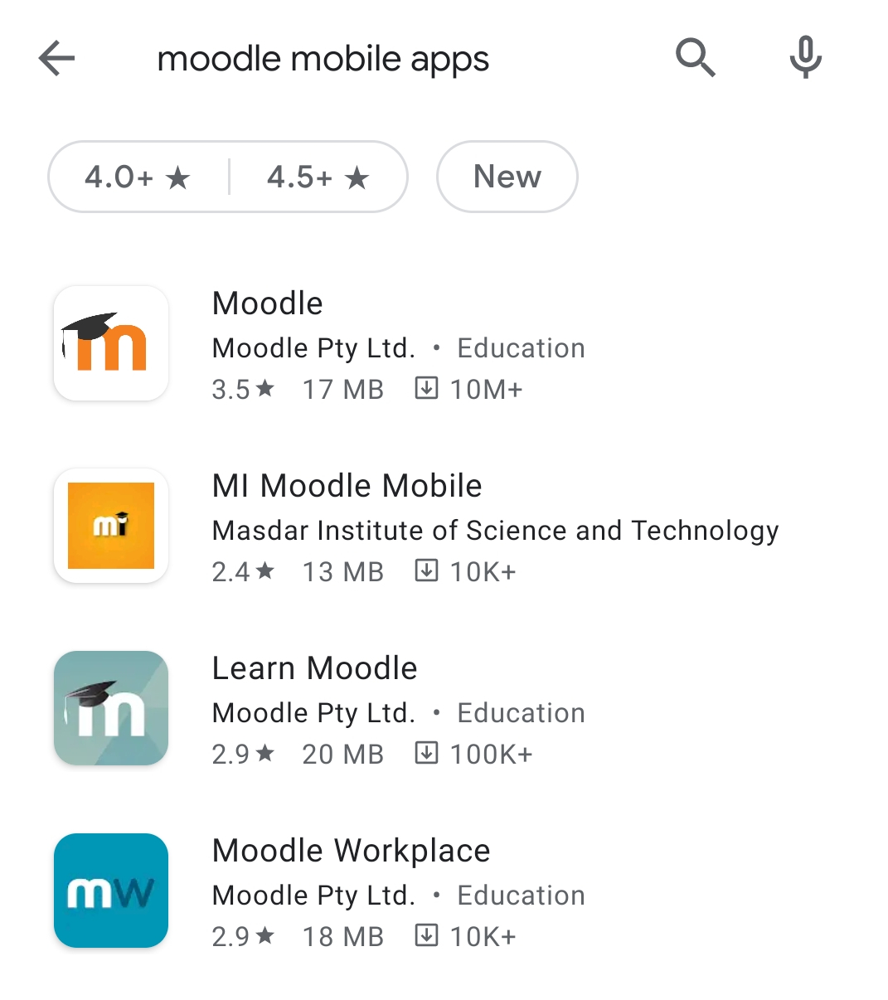
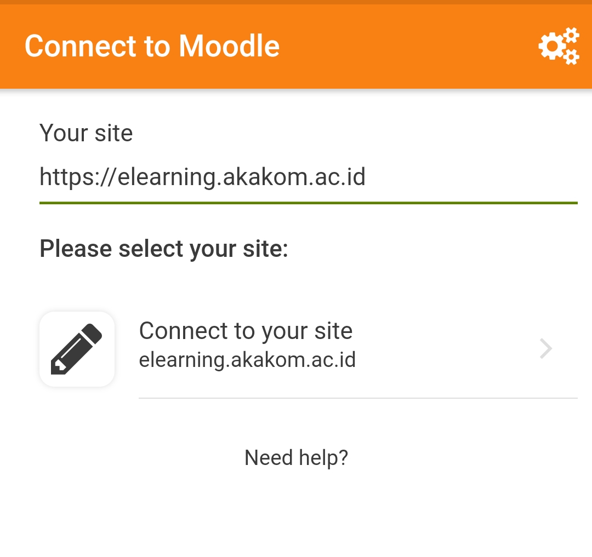
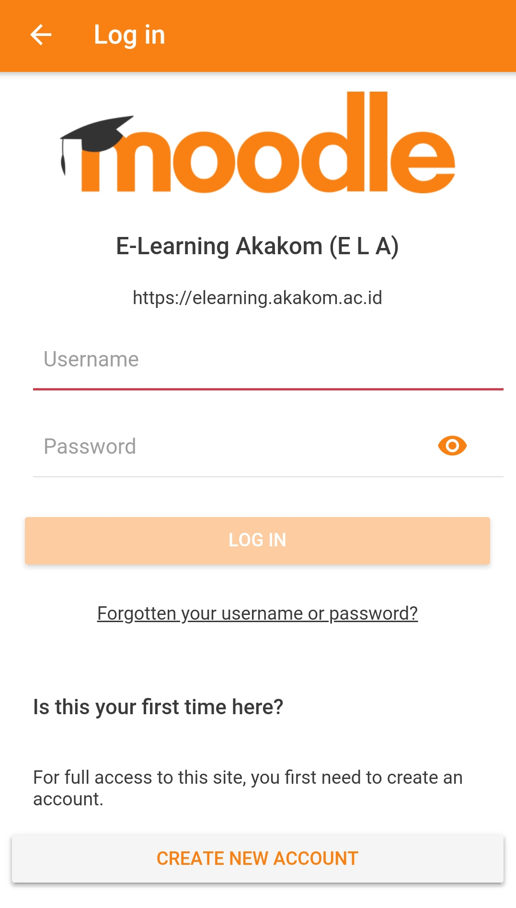
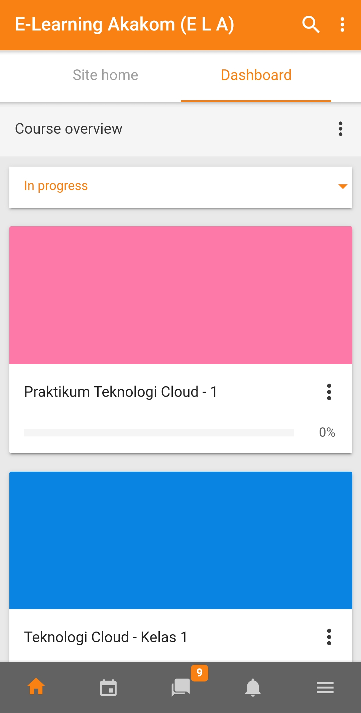
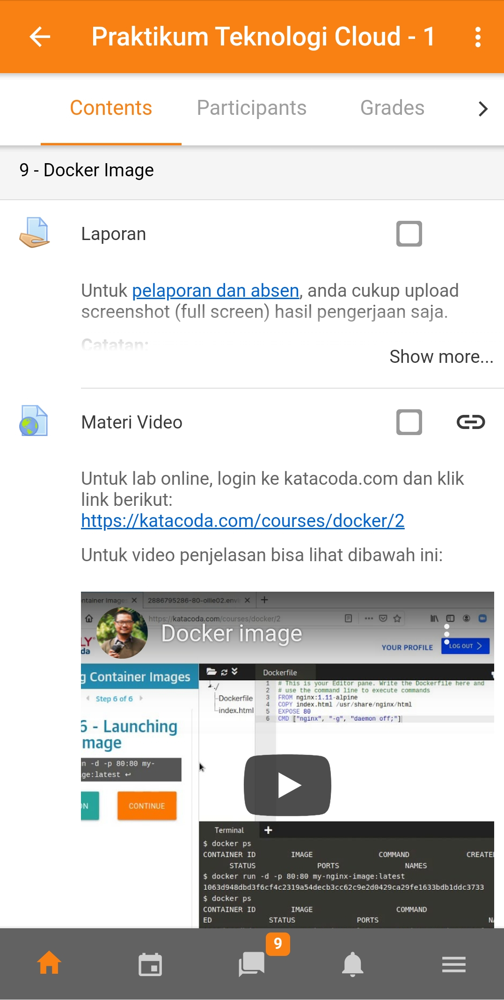

Moodle adalah platform elearning open source yang mudah digunakan dan umum dipakai oleh institusi dan sekolah di Indonesia. Untuk mempermudah akses melalui perangkat smartphone secara mobile, moodle telah menyediakan android apps yang bisa menjadi viewer untuk halaman di moodle. Dengan aplikasi android ini, walaupun menggunakan server sendiri, moodle tetap dapat di akses melalui perangkat smartphone.

STMIK AKAKOM merupakan salah satu perguruan tinggi yang menggunakan moodle dalam model pembelajaran secara daring, sistem ini dikenal dengan nama **ELA**. Pada tulisan ini, akan dibahas langkah-langkah untuk dapat mengakses layanan elearning.akakom.ac.id menggunakan apps android moodle.

> **Sebelum melakukan proses ini, silahkan mendaftarkan diri terlebih dahulu via website [elearning.akakom.ac.id](https://elearning.akakom.ac.id) dan pilih kelas-kelas yang akan anda ikuti.**

## Instalasi

Untuk proses instalasi, anda dapat menggunakan android playstore dan search dengan kata kunci "moodle". Setelah mendapatkan tampilan seperti dibawah ini, pilih apps moodle untuk di instal ke dalam perangkat anda.

## Koneksi ke web elearning AKAKOM

Setelah proses instalasi selesai anda akan mendapatkan halaman dashboard moodle dengan pilihan I'AM LEARNER dan I'AM AN EDUCATOR. Pada tahapan ini, klik tombol **skip** pada kanan atas. Setelah skip, anda akan diarahkan pada sebuah tampilan dimana perlu memberikan input dalam bentuk url. Masukkan url https://elearning.akakom.ac.id pada halaman ini, kemudian klik tombol **Connect to site**.

## Masuk kedalam apps moodle

Setelah connect to site, anda akan mendapatkan halaman login. Pada proses ini, silahkan masukkan username dan password yang sudah anda miliki.

Setelah melewati proses login, anda akan masuk ke halaman elearning dashboard, dan akan menampilkan mata kuliah yang anda ikuti.

Sampai tahapan ini, anda bisa mengisi presensi dan mengikuti perkuliahan baik materi, quiz, atau pengumpulan tugas. Selain itu fitur grade juga dapat menunjukkan hasil nilai-nilai dari mata kuliah yang telah anda ikuti.

## Kesimpulan

Anda dapat menggunakan apps moodle ini untuk melakukan proses monitoring, juga melihat notifikasi jika ada materi mata kuliah yang baru masuk. Dari sisi dosen, apps ini sudah cukup powerfull untuk monitoring segala aktivitas mahasiswa pada sistem ELA.