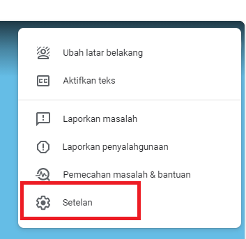
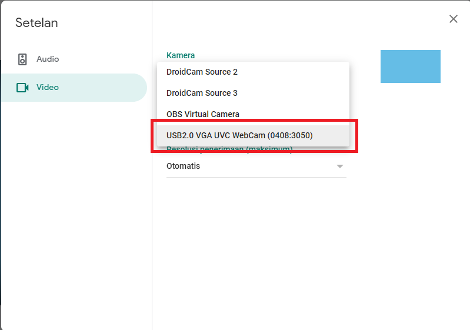
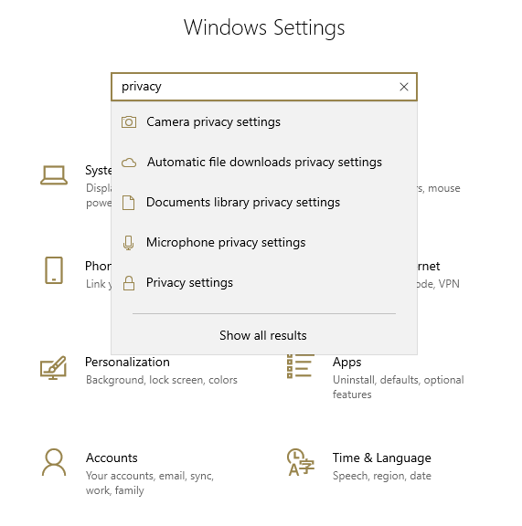
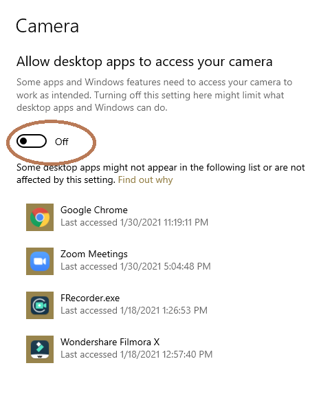

Google Meet adalah salah satu alternative untuk video conference atau meeting. Selain aplikasi ini gratis, juga tidak ada limitasi waktu seperti halnya zoom versi gratis. Namun persoalan fitur, UI, atau masalah teknis terkadang menjadikan seseorang memilih menggunakan Zoom meskipun harus berbayar. 

Permasalahan video webcam yang tidak tampil ketika menjalankan google meet sangat umum terjadi, problem utama jika perangkat sudah berjalan baik biasanya adalah privacy dan konfigurasi pada google chrome. Pada tutorial ini akan saya bahas mengenai beberapa hal yang perlu dilakukan sebelum menjalankan google meet.

## 1. Cek setting pada aplikasi google meet

Pada layar google meet anda terdapat titik 3 pada pojok kanan. 

Klik tanda tersebut dan masuk ke menu setting atau setelan. 

Setelah masuk anda akan mendapatkan 2 pilihan yaitu audio dan video. Dengan melihat problem yang dihadapi dalam contoh ini adalah video, berarti masuklah ke menu video.

Pada setelan ini anda memiliki pilihan untuk menggunakan video webcam, bisa menggunakan bawaan dari webcam laptop anda atau juga bisa menggunakan droidcam (jika menggunakan webcam via smartphone) atau OBS.\
\
Jika anda mendapati webcam belum terdeteksi, lakukan dahulu langkah kedua dan ketiga pada tutorial ini.

## 2. Setting privacy camera untuk aplikasi desktop

Pertama, anda perlu masuk ke menu setting OS Windows, jika menggunakan windows 10 seperti pada tutorial ini, cukup anda tekan logo windows, dan ketik kata "setting" pada menu search. 

Pada gambar diatas ketikan kata "privacy" pada input search, maka anda akan mendapatkan pilihan seperti gambar. Pada tahap ini, pilihlah **camera  privacy settings**. Setelah anda masuk pada bagian ini, anda bisa melakukan scroll ke bawah dan mencari judul **Allow desktop apps to access your camera** seperti pada gambar dibawah ini:

Secara default biasanya windows 10 memerlukan izin untuk memberikan akses webcam ke aplikasi tertentu. Pada gambar diatas, di bagian yang dilingkari, anda dapat aktifkan menjadi **on**. \
\
Sampai pada tahap ini, kita akan melanjutkan kembali ke tahap 3, untuk setting di browser. *Pada tahapan kedua ini, bisa saja anda masuk kembali ke menu setting atau setelan pada google meet dan menemukan bahwa webcam anda sudah bisa digunakan*.

## 3. Setting browser chrome